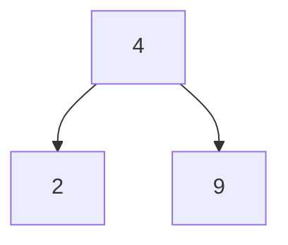
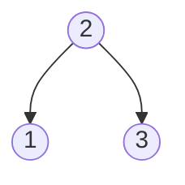
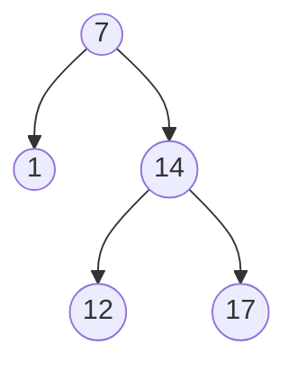
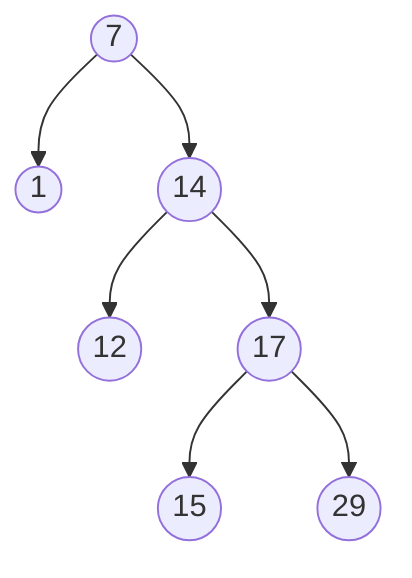
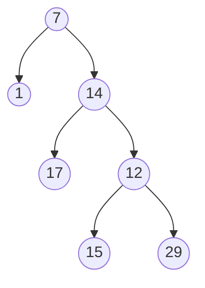
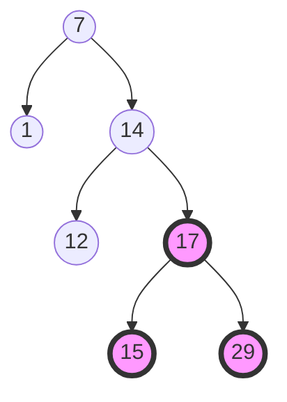
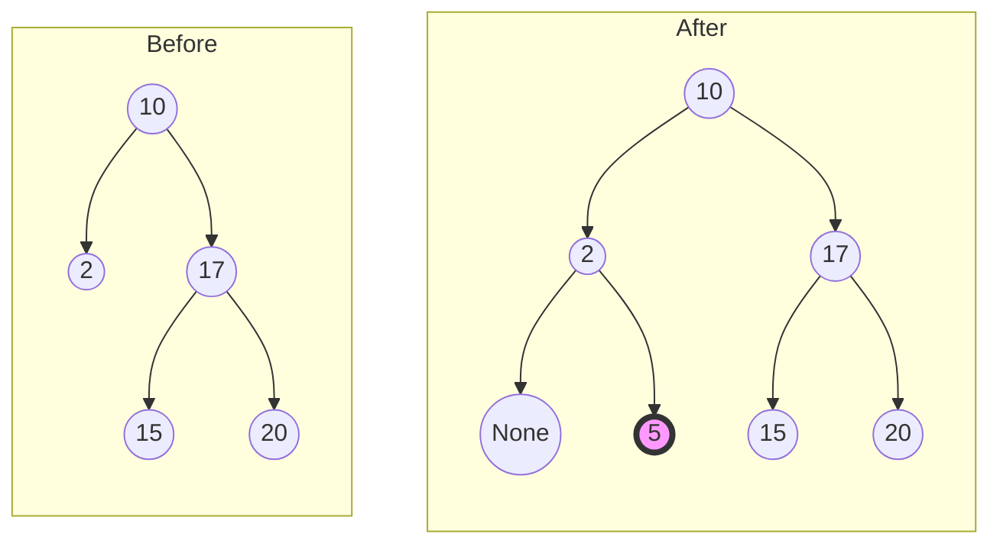
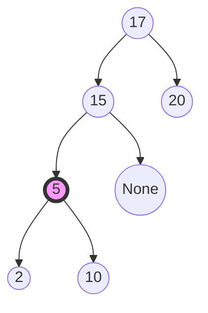

# Binary Search Tree

## Purpose

The following coding exercises are designed to test your knowledge of the following concepts:
* Properties of BSTs
* Operations with BSTs

## Overview

The coding exercises cover the following practical problems:
* Checking whether a given binary tree is height-balanced
* Checking whether a given binary tree is a BST
* Implementing the `search` operation for a BST
* Implementing the `insert` operation for a BST

## Coding exercises

### Basic data structure for representing BSTs

For all coding exercises, assume the following data class will be used to represent tree nodes:

```python
class TreeNode:
    def __init__(
        self,
        value: int = 0,
        left: Optional['TreeNode'] = None,
        right: Optional['TreeNode'] = None
    ):
        self.value = value
        self.left = left
        self.right = right
```

The implementation above can be found in the `tasks/binary_tree_node.py` file.

For example, the following tree can be created using the snippet below:



```python
b = TreeNode(value=2)
c = TreeNode(value=9)
a = TreeNode(value=4, left=b, right=c)
```

### Exercise 1: Check whether a given binary tree is height-balanced

Determine whether a given binary tree is height-balanced.

For this problem, a height-balanced binary tree is defined as:

> a binary tree in which the left and right subtrees of every node differ in height by no more than 1.

**Example 1:**


Expected result: True.

**Example 2:**


Expected result: True.

**Example 3:**


Expected result: False.

<br>

Please use the template `tasks/binary_tree:is_balanced` for the implementation.

### Exercise 2: Check whether a given binary tree is a BST

Given the `root` of a binary tree, *determine if it is a valid BST*.

A valid BST is defined as follows:

* The left subtree of a node contains only nodes with keys **less than** the node's key.
* The right subtree of a node contains only nodes with keys **greater than** the node's key.
* Both the left and right subtrees must also be BSTs.

**Example 1:**


Expected result: True.

**Example 2:**


Expected result: True.

**Example 3:**


Expected result: False.

<br>

Please use the template `tasks/binary_tree:is_binary_search_tree` for the implementation.


### Exercise 3: Implement the search operation for a BST

You are given the `root` of a BST and an integer `value`.

Find the node in the BST whose value equals `value`, and return the subtree rooted with that node. If no such node exists, return `null`.


**Example:**

`value=17`


Expected result: a node with the value 17.


Please use the template `tasks/binary_search_tree:search_in_bst` for the implementation.


### Exercise 4: Implement the insert operation for a BST

You are given the `root` node of a BST and a `value` to insert into the tree. Return *the root node of the BST after the insertion*.
It is **guaranteed** that the new value does not exist in the original BST.

**Notice** that there may exist multiple valid ways to do the insertion, but the tree must remain a BST after insertion. You can return **any of them**.

**Example:**

`value=5`



Explanation: another accepted tree is:



<br>

Please use the template `tasks/binary_search_tree:insert_in_bst` for the implementation.
