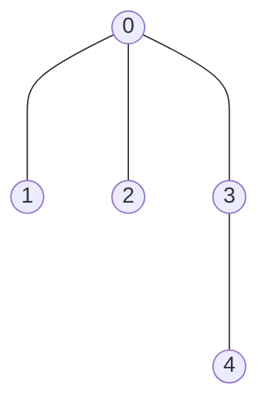
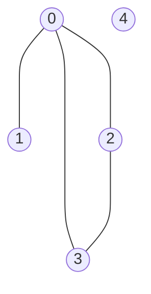
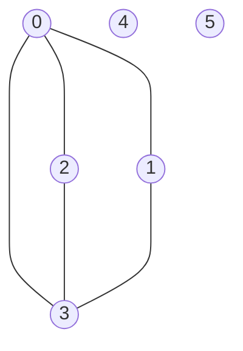

# Disjoint Sets

## Purpose

The following coding exercises are designed to test your knowledge of the following concepts:

* A disjoint set data structure and API

## Overview

The coding exercises cover the following practical problems:
* Implementing data structure of disjoint sets
* Checking whether a given graph is a tree

## Coding exercises

### Exercise 1: Implement a disjoint sets data structure

Your task is to implement the provided interface below for a disjoint sets data structure.

```python

# For simplicity, assume that keys are either strings or integers.
KeyType = Union[str, int]

class DisjointSets:
    """Interface for supporting disjoint sets.
    
    NOTE: the expected implementation should contain:
    * 'path compression' heuristic
    * 'union be rank' heuristic (height)
    """

    def __init__(self):
        # Think about required class attributes to support the requirements.
        pass

    def make_set(self, key: KeyType):
        """Creates a new set that is associated with a given key."""
        pass
    
    def find_set(self, key: KeyType) -> KeyType:
        """Returns a unique set identifier (key) of a given's key set.
        
        NOTE: 'path compression' heuristic should be used.
        """
        pass

    def union_sets(self, first_key: KeyType, second_key: KeyType):
        """Joins two given sets into a new one.
        
        NOTE: 'union by rank' heuristic should be used (the height one).
        NOTE: if the sets that correspond to the given keys are of the same rank,
        if is preferable to use the second set when deciding what set is to be used as a new 'root'.
        """
        pass
```

</br>

Please use the template `tasks/disjoint_sets:DisjointSets` for the implementation.

### Exercise 2: Check whether a given graph is a tree

You have a graph of `n` nodes labeled from `0` to `n - 1`. You are given an integer `n` and a list of `edges` where `edges[i] = [a_i, b_i]` indicates that there is an undirected edge between nodes `a_i` and `b_i` in the graph.

Return `true` *if the edges of the given graph make up a valid tree, and `false` otherwise*.

Your task is to implement the following function to solve the problem above:

```python
def is_valid_tree(n: int, edges: List[Tuple[int, int]]) -> bool:
    """Checks whether a given graph is a valid tree.

    Args:
        n: int, number of vertexes in a given graph.
        edges: List[Tuple[int, int]], list of edges of a given graph.

    Returns:
        Whether a given graph is a valid tree.
    """
    pass
```

**Example 1:**


Input:

n = 5

edges = [(0, 1), (0, 2), (0, 3), (3, 4)]


Expected result: true.

**Example 2:**


Input:

n = 5

edges = [(0, 1), (0, 2), (0, 3), (2, 3)]


Expected result: false.

**Example 3:**


Input:

n = 6

edges = [(0, 1), (0, 2), (0, 3), (2, 3), (0, 3)]


Expected result: false.

<br>

Please use the template `tasks/tree_validity:is_valid_tree` for the implementation.
